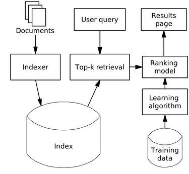
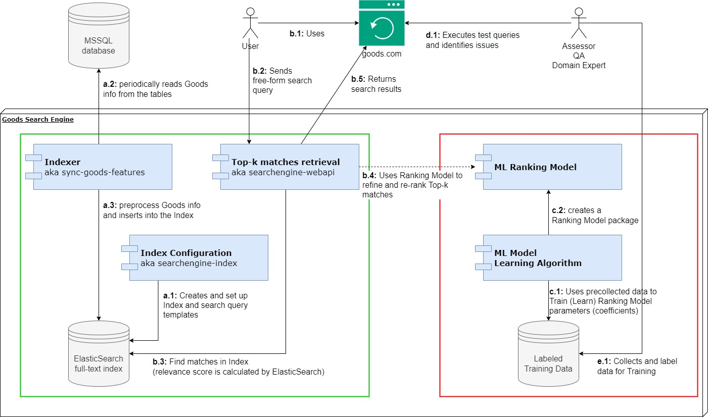

# Search Engine Specification

## 1. General notes on architecture

This specification describes search engine architecture and its components.
The diagram below illustrates the currently selected approach to search and rank Goods,
although there are no `ML Learning algorithm`, `ML Ranking model` and `Labeled Training data` at the moment.





## 2. Components and Functional schema

## 2.1 Key Components

Arrows show the direction of an action. Set of actions marked as a, b, c, d, e can be executed independently and periodically.  
The components in the green bounding box is what we've implemented. The components in the red bounding box is what we do not have at the moment.

`MSSQL Database table`  
Contains information about Goods. Information comes from Goods's main database. Currently, all information is accumulated in *Goods.ElasticSearchGoodsFeatures* table.

Runs on a dedicated machine.

`Indexer`  
The search engine system component which represents Goods information in a way to enable a quick search among millions of
goods using any available information. It decides which information is critical for search, how to transform it, which algorithms to
use during the searching process. We call such information "Goods features".

*Indexer* is represented by three coherent components [ElasticSearch](elasticsearch-setup/README.md), 
[searchengine-index](searchengine-index/README.md) and [sync-goods-features](sync-goods-features/README.md).

Periodically automatically runs on a dedicated machine.

`ElasticSearch Index`  
Stores Goods features prepared by Indexer.

*ElasticSearch Index* is represented by two coherent components [ElasticSearch](elasticsearch-setup/README.md) 
and [searchengine-index](searchengine-index/README.md).

`User and its queries`  
An input search query which is retrieved from User and then is sent to the search engine to find most relevant matches.  
Usually the search query comes from a Browser which is considered as UI.

`Top-k matches retrieval`  
Runs on a dedicated machine.  
Component which uses search query to find K most relevant Goods. Currently, for the search we use such features as *GoodsId*,
*GoodsStatusId*, *GoodsRefsCount*, *ClassesCount*. All the rest of the information is ignored. What we have here are these features,
and a matching algorithm (Okapi_BM25 to be precise) which mostly relies on *GoodsId* text and its similarity to the search query text. Plus
my calibration to the searching process to take *GoodsStatusId*, *GoodsRefsCount*, *ClassesCount* features into account.  

*Top-k matches retrieval* is represented by ElasticSearch, [searchengine-webapi](searchengine-webapi/README.md) and [searchengine-index](searchengine-index/README.md).

Notes
-----

`Learning Algorithm`  
Periodically automatically runs on a dedicated machine.  
Component which implements an algorithm to create *Ranking Model*. *Learning Algorithm* can be based on common Machine Learning methods, like supervised or
unsupervised and implemented using such popular libraries as [scikit-learn](https://scikit-learn.org/stable/index.html), [CatBoost](https://catboost.ai/), etc.

`Ranking Model`  
An algorithm which contains knowledge about what should be the most relevant subset of Goods for a particular search query.  
For example, Ranking model can be based on CatBoost supervised ranking learning algorithms which fits its parameters (aka "knowledge") using Training data.

`Labeled Training data`  
Is a special dataset which is used by *Learning Algorithm* to fit *Ranking Model*.  
In short, a labeled relevance dataset is a set of search queries with results that have been labeled with a relevance rating. Here’s an example of a very small dataset with just a single query in it

```json
{
  "search_query": "nike company",
  "results": [
    { "rank": 1, "id": "doc2", "label_id": 2, "label": "relevant" },
    { "rank": 2, "id": "doc1", "label_id": 3, "label": "very relevant" },
    { "rank": 3, "id": "doc8", "label_id": 0, "label": "not relevant" },
    { "rank": 4, "id": "doc7", "label_id": 1, "label": "related" },
    { "rank": 5, "id": "doc3", "label_id": 3, "label": "very relevant" }
  ]
}
```

The labels are arbitrary, and we can choose a different scale, four labels above are pretty common.  
One way to get these labels is to source them from our assessors/QAs/domain experts. A group of people can look through the search query logs and for each of the results, provide a label.  
This can be quite time-consuming so, possibly, we can try to log user clicks and use a click model to convert click activity into relevance labels.  
Possibly, we can use GA users journeys information. It means we need to store search queries, search results, GA info. Then
periodically unite all that data, preprocess it, create Training data and run *Learning Algorithm* to produce a new, improved version of *Ranking Model*. 

`Results page`  
A place which displays search results.


## 2.2 Functional Schema

So, the whole function looks like the following.
1. Documents from *MSSQL Database table* get passed into *Indexer*.
2. *Indexer* preprocess and transforms Documents and store it as an *ElasticSearch Index*.
3. Assessors (humans) collects *Labeled Training data*, which possibly consists of pairs <search_query, ranked_results> as an examples.
4. System runs *Learning Algorithm* to produce *Ranking Model*.   
5. *Top-k matches retrieval* component receives ad-hoc "search query".
6. *Top-k matches retrieval* preprocess "search query" and asks *ElasticSearch Index* in its special language to find Documents
   which matches the search query.
7. *Top-k matches retrieval* gets k most relevant documents according to *ElasticSearch Index* and pass them to *Ranking Model* for re-ranking.
8. Top-n re-ranked results are returned to *Results page*.

The steps [1-2] are run periodically.  
The steps [3-4] are run periodically.
The steps [5-8] are run ad-hoc.  
The steps [1-2], [3-4], [5-8] are generally run in parallel once [1-4] were executed sequentially in the beginning during deployment having the same Documents and Index structure.

> Note that [3-4] are absent in the current implementation.

## 3. Deployment

1. Install and setup [ElasticSearch](elasticsearch-setup/README.md).
2. Setup index structure and search templates [searchengine-index](searchengine-index/README.md).
3. Setup, deploy and run [sync-goods-features](sync-goods-features/README.md) to import information about available Goods into *Index*.
4. Setup, deploy and run [searchengine-webapi](searchengine-webapi/README.md) to have REST API to get search queries and response with a ranked list of most relevant (similar) Goods.
5. Configure networking, logging, monitoring, and security for all Search Engine components.
6. Setup alerting to recognize and anticipate failures and other performance issues in Search Engine components.