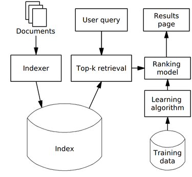

# Specification

## 1. Purpose

ElasticSearch is being used as an **Indexer** and **Index** components on the diagram below.   

## 2. ES Installation

1. Install ElasticSearch v7.14.*
2. Install plugins  
`sudo bin/elasticsearch-plugin install analysis-phonetic`
3. [Setup security settings or close ES into private network](https://www.elastic.co/guide/en/elasticsearch/reference/7.14/security-basic-setup.html)

## 3. Setup index
Go to [searchengine-index](../searchengine-index/README.md).

Increase search idle time  
``curl -X PUT "localhost:9200/<index_name>/_settings?pretty" -H 'Content-Type: application/json' -d'
    {
        "index" : {
            "search.idle.after" : "24h"
        }
    }
``
